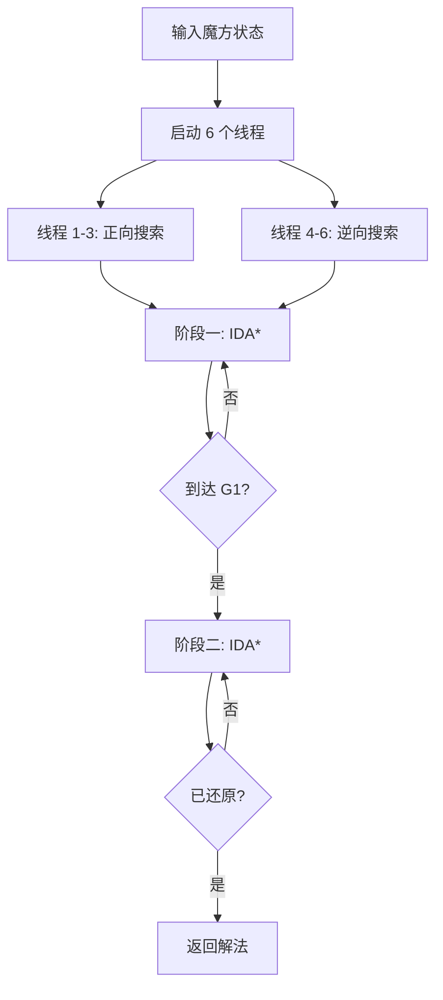

# Kociemba二阶段算法源码深度解析

> **作者**: Ywj  
> **日期**: 2026年3月2日  
> **标签**: `算法` `魔方` `IDA*` `搜索优化`

---

## 📚 目录

- [1. 算法背景与核心思想](#1-算法背景与核心思想)
- [2. 文件结构总览](#2-文件结构总览)
- [3. 核心文件详解](#3-核心文件详解)
- [4. 学习路径推荐](#4-学习路径推荐)
- [5. 关键代码段解析](#5-关键代码段解析)
- [6. 性能分析](#6-性能分析)

---

## 1. 算法背景与核心思想

### 1.1 什么是 Kociemba 算法？

Kociemba 算法（又称**二阶段算法**）是由德国数学家 **Herbert Kociemba** 于 1992 年提出的高效魔方求解算法。

**核心特性：**

| 特性     | 数值                |
|--------|-------------------|
| 平均求解步数 | **18-20 步**       |
| 最坏情况   | **20 步**（上帝数）     |
| 求解时间   | **< 1 秒**（普通 CPU） |
| 存储需求   | **~67 MB**（所有表文件）   |


### 1.2 两阶段分解原理

#### 🎯 阶段一：初始状态 → G1 子群

**目标**：将魔方从任意状态变换至 G1 子群状态。

**G1 子群定义**：

- **角块色向正确**：所有角块方向值之和 = 0 (mod 3)。
- **棱块色向正确**：所有棱块方向值之和 = 0 (mod 2)。
- **中层棱块归位**：FR, FL, BL, BR 四个棱块全部回到中层（E-layer）槽位中，不计顺序。

**状态空间** (用于建立修剪表) ：

```
角块色向：    3^7  = 2,187  种状态
棱块色向：    2^11 = 2,048  种状态
中层棱块位置： C(12,4) = 495 种状态
总计：2,217,093,120 (约22亿)
```

#### 🎯 阶段二：G1 子群 → 还原状态

**可用操作**：{ U, D, L2, R2, F2, B2 }（这些操作能保持 G1 的特征不被破坏）。

**目标**：在不改变块方向的前提下，通过位置置换完成还原。

**状态空间**：

```
角块位置：   8!    = 40,320  种状态
棱块位置：   8!    = 40,320  种状态
中层棱块：   4!    = 24      种状态
总计：由于总置换奇偶性限制，实际空间为 40,320 * 40,320 * 24 / 2 = 19,508,428,800 （约195亿）
```


### 1.3 算法划分的理论依据与技术优势

Kociemba 算法之所以采用两阶段搜索架构，而非直接对全状态空间进行搜索，是基于以下深层次的考量：

#### 1. 状态空间的指数级降维

魔方的全状态空间高达 **4.33 × 10¹⁹**，直接建立索引或启发式表在计算上是不可行的。

- **分阶段处理**：通过引入 **G₁ 子群**作为中间目标，将复杂问题拆解为两个规模可控的子问题。
- **修剪表可行性**：阶段二最大的独立子空间为 **8!**（40,320），这使得算法可以预先计算并存储所有可能的距离值（即修剪表），在搜索过程中实现常数时间复杂度的启发式查询。

#### 2. 算子集对子群性质的保持

在阶段二中，操作集限定为 **⟨U, D, L2, R2, F2, B2⟩**。这一划分的科学性在于：

- **方向不变性（Orientation Invariance）**：上述算子属于 **G₁ 子群**的生成元，它们不会改变棱块和角块的方向。因此，阶段一确定的方向属性在阶段二中具有**不变量**性质。
- **轨道闭合性（Orbital Closure）**：在这些特定操作的作用下，中层棱块（E-slice edges）与顶底层棱块（UD-layer edges）形成了互相独立的置换轨道。这种**轨道隔离**确保了中层棱块在阶段二中永远不会移出 E 层槽位，从而允许算法将两组棱块的置换逻辑进行解耦。

#### 3. 搜索效率的优化

这种划分极大缩短了搜索树的深度。

- **阶段一**：侧重于“定性”约束（方向与层归属），其搜索目标明确，路径较短。

- **阶段二**：侧重于“定量”排列（位置置换）。

  由于两个阶段的启发式估值函数（Heuristic Function）相互独立且高度优化，IDA* 算法能够快速剪枝，从而在毫秒级时间内找到总步数在 20 步左右的近优解。


### 1.4为什么使用 IDA* 算法？

> **IDA*** = 迭代加深搜索（DFS） + 启发式函数 + 深度限制

**优势**：

- ✅ 能找到最短路径（类似 BFS）
- ✅ 内存消耗小（类似 DFS）
- ✅ 通过剪枝表快速评估

---

## 2. 文件结构总览

### 2.1 核心算法文件 

| 文件名               | 行数  | 核心功能               |
|-------------------|-----|--------------------|
| **solver.py**     | 311 | 两阶段搜索算法主逻辑，IDA* 实现 |
| **pruning.py**    | 332 | 剪枝表生成与查询，启发式函数     |
| **moves.py**      | 210 | 移动表，坐标转换核心数据结构     |
| **cubie.py**      | 561 | 魔方块层次表示，基本数据结构     |
| **coord.py**      | 223 | 坐标层次表示，状态编码        |
| **symmetries.py** | -   | 对称性处理，减少搜索空间       |


### 2.2 辅助文件 

| 文件名          | 功能                 |
|--------------|--------------------|
| **defs.py**  | 常量定义（状态空间大小等）      |
| **enums.py** | 枚举类型（角块、棱块、颜色、移动等） |
| **face.py**  | 面层次表示（颜色编码）        |
| **misc.py**  | 工具函数（排列组合等）        |


### 2.3 非核心文件

| 文件名                             | 用途      |
|---------------------------------|---------|
| client_gui.py / client_gui2.py  | GUI 客户端 |
| computer_vision.py / vision2.py | 计算机视觉   |
| server.py / sockets.py          | 网络通信    |
| performance.py                  | 性能测试    |

---

## 3. 核心文件详解

### 3.1 solver.py - 算法核心 

**关键类和方法：**

```python
class SolverThread:
    def search(flip, twist, slice_sorted, dist, togo_phase1):
        """阶段一：IDA* 搜索，从初始状态到 G1 子群"""
        
    def search_phase2(corners, ud_edges, slice_sorted, dist, togo_phase2):
        """阶段二：在 G1 子群内搜索到还原状态"""

def solve(cubestring, max_length=20, timeout=3):
    """主入口：多线程求解魔方"""
```

**核心逻辑流程：**



**代码位置：**
- 第 106-179 行：阶段一搜索（IDA*）
- 第 53-104 行：阶段二搜索
- 第 209-250 行：主求解函数，启动 6 个线程并行搜索

---

### 3.2 pruning.py - 剪枝表 

**三个关键剪枝表：**

#### 📊 阶段一剪枝表

```python
flipslice_twist_depth3  
# 存储：(棱块方向 + slice) 与 角块方向的组合
# 原始大小：64430 * 2187 ≈ 140,893,410 个状态
# 压缩后：34 MB（每个状态仅占 2 bit）
# 压缩比：约 4 倍
# 查询复杂度：O(1)
```

#### 📊 阶段二剪枝表

```python
corners_ud_edges_depth3  
# 存储：角块位置与 UD 棱块位置的组合
# 原始大小：2768 * 40320 ≈ 111,605,760 个状态
# 压缩后：27 MB（每个状态仅占 2 bit）
# 压缩比：约 4 倍
# 查询复杂度：O(1)
```

#### 📊 快速预检表

```python
cornlice_depth  
# 用途：阶段二开始时快速剪枝
# 大小：40320 * 24 ≈ 1 MB
```

**剪枝表生成算法：**

```python
# 从还原状态开始，使用 BFS 搜索
# 只关注某一属性（如角块方向）
# 记录每种状态到目标的最短步数
# 存入查找表，供后续快速查询
```

**代码位置：**

- 第 52-173 行：生成阶段一剪枝表（BFS + 对称性）
- 第 175-275 行：生成阶段二剪枝表
- 第 278-315 行：生成 cornslice 预检表

---

### 3.3 moves.py - 移动表 

**关键数据结构：**

```python
# 角块方向移动表
twist_move[2187 * 18]  
# 索引：twist_move[当前状态 * 18 + 移动] = 新状态

# 棱块方向移动表
flip_move[2048 * 18]

# 中层棱块位置移动表
slice_sorted_move[11880 * 18]

# 角块位置移动表
corners_move[40320 * 18]

# UD 棱块位置移动表
ud_edges_move[40320 * 18]
```

**作用**：预计算所有可能的移动结果，O(1) 时间查询，避免实时计算。

**生成过程：**

```python
for i in range(N_TWIST):  # 遍历所有状态
    a.set_twist(i)        # 设置当前状态
    for j in Color:       # 6 个面
        for k in range(3): # 3 种移动（U, U2, U'）
            a.corner_multiply(basicMoveCube[j])
            twist_move[N_MOVE * i + 3 * j + k] = a.get_twist()
        a.corner_multiply(basicMoveCube[j])  # 恢复
```

---

### 3.4 cubie.py - 魔方块表示 

**核心类：**

```python
class CubieCube:
    cp[8]   # 角块位置（Corner Permutation）
    co[8]   # 角块方向（Corner Orientation）: 0/1/2
    ep[12]  # 棱块位置（Edge Permutation）
    eo[12]  # 棱块方向（Edge Orientation）: 0/1
```

**示例：**

```python
# URF 位置存储 UFL 块，方向为 1
co[URF] = {UFL, 1}  

# UR 位置存储 DF 块，方向为 0
ep[UR] = {DF, 0}
```

**关键方法：**

| 方法 | 功能 |
|------|------|
| `corner_multiply()` | 角块乘法（状态转移） |
| `edge_multiply()` | 棱块乘法 |
| `get_twist()` | 提取角块方向坐标 |
| `get_flip()` | 提取棱块方向坐标 |
| `verify()` | 验证魔方状态合法性 |

---

### 3.5 coord.py - 坐标表示 

**核心类：**

```python
class CoordCube:
    # 阶段一坐标
    twist         # 角块方向 (0-2186)
    flip          # 棱块方向 (0-2047)
    slice_sorted  # 中层棱块位置 (0-11879)
    
    # 阶段二坐标
    corners       # 角块位置 (0-40319)
    ud_edges      # UD 棱块位置 (0-40319)
```

**关键方法：**

```python
def get_depth_phase1(self):
    """查询阶段一距离（启发式函数）"""
    # 查询剪枝表，返回到 G1 子群的最小步数
    
def get_depth_phase2(self, corners, ud_edges):
    """查询阶段二距离（启发式函数）"""
    # 查询剪枝表，返回到还原状态的最小步数
```

---

### 3.6 defs.py - 常量定义

**关键常量：**

```python
# 阶段一状态空间
N_TWIST = 2187           # 3^7 角块方向数
N_FLIP = 2048            # 2^11 棱块方向数
N_SLICE_SORTED = 11880   # 12*11*10*9 中层棱块位置数

# 阶段二状态空间
N_CORNERS = 40320        # 8! 角块排列数
N_UD_EDGES = 40320       # 8! UD 棱块排列数

# 对称性约减
N_FLIPSLICE_CLASS = 64430  # 对称性约减后的类数
N_CORNERS_CLASS = 2768     # 对称性约减后的类数
```

---

## 4. 学习路径推荐

### 🎯 阶段一：基础概念（1-2 天）

**阅读顺序：**

```
enums.py → defs.py → cubie.py（前 100 行）
```

**理解重点：**

1. **魔方的三种表示**
   - Facelet（面）：54 个颜色块
   - Cubie（块）：8 角块 + 12 棱块
   - Coordinate（坐标）：数字索引

2. **方向定义**
   - 角块方向：3 种（0/1/2），为什么是 3^7？
   - 棱块方向：2 种（0/1），为什么是 2^11？

3. **基本移动的数学表示**
   - 置换群（Permutation Group）
   - 移动 = 置换 + 方向变化

---

### 🎯 阶段二：核心算法（3-5 天）

**深入阅读：**

```
coord.py → moves.py → pruning.py → solver.py
```

**理解重点：**

1. **坐标编码**
   - 如何将魔方状态映射为数字索引？
   - 为什么使用坐标表示而不是直接操作块？

2. **移动表**
   - 如何预计算状态转移？
   - 移动表的大小与生成时间

3. **剪枝表**
   - 如何生成启发式函数？
   - BFS 搜索 + 对称性约减

4. **IDA* 搜索**
   - 两个阶段的搜索流程
   - 剪枝条件与回溯

---

### 🎯 阶段三：优化技术（2-3 天）

**高级主题：**

```
symmetries.py（对称性处理）
```

**理解重点：**

1. **对称性原理**
   - 魔方的 48 种对称操作
   - 如何利用对称性减少搜索空间？

2. **对称性约减**
   - 状态数从 **4.33 × 10¹⁹** 降至可管理的规模
   - 等价类（Equivalence Class）的概念

---

## 5. 关键代码段解析

### 5.1 阶段一搜索核心

**位置**：`solver.py:150-179`

```python
for m in Move:  # 遍历 18 种移动
    # 1. 应用移动，更新坐标
    flip_new = mv.flip_move[18 * flip + m]
    twist_new = mv.twist_move[18 * twist + m]
    slice_sorted_new = mv.slice_sorted_move[18 * slice_sorted + m]
    
    # 2. 查询剪枝表，获取启发式距离
    flipslice = 2048 * (slice_sorted_new // 24) + flip_new
    classidx = sy.flipslice_classidx[flipslice]
    sym = sy.flipslice_sym[flipslice]
    dist_new_mod3 = pr.get_flipslice_twist_depth3(
        2187 * classidx + sy.twist_conj[(twist_new << 4) + sym]
    )
    dist_new = pr.distance[3 * dist + dist_new_mod3]
    
    # 3. 剪枝：如果无法在剩余步数内到达目标，跳过
    if dist_new >= togo_phase1:
        continue
    
    # 4. 递归搜索
    self.sofar_phase1.append(m)
    self.search(flip_new, twist_new, slice_sorted_new, dist_new, togo_phase1 - 1)
    self.sofar_phase1.pop(-1)
```

---

### 5.2 剪枝表查询与位压缩技术

**位置**：`pruning.py:22-26`

```python
def get_flipslice_twist_depth3(ix):
    """查询状态 ix 到目标的距离（mod 3）"""
    y = flipslice_twist_depth3[ix // 16]  # 从数组中读取
    y >>= (ix % 16) * 2                    # 位操作，每个状态占 2 bit
    return y & 3                           # 取模 3 的结果
```

**位压缩技术详解**：

| 技术 | 说明 |
|------|------|
| **压缩原理** | 每个状态只存储 mod 3 的值（0, 1, 2），占用 2 bit |
| **数据结构** | 使用 `uint32` 数组，每个元素存储 16 个状态 |
| **索引计算** | `ix // 16` 定位到哪个 `uint32`，`ix % 16` 定位到哪 2 bit |
| **位操作** | 右移 `>>` 和与运算 `&` 提取目标值 |
| **压缩比** | 相比 1 字节存储节省约 **4 倍**空间 |

**存储效率对比**：

```
未压缩：140,893,410 状态 × 1 字节 = 134 MB
压缩后：140,893,410 状态 ÷ 16 × 4 字节 = 33.6 MB
节省空间：134 MB - 33.6 MB ≈ 100 MB（节省 75%）
```

---

### 5.3 多线程并行搜索

**位置**：`solver.py:225-245`

```python
# 启动 6 个线程并行搜索
for i in range(6):
    th = SolverThread(cc, i % 3, i // 3, max_length, timeout, 
                      s_time, solutions, terminated, shortest_length)
    my_threads.append(th)
    th.start()

# 等待所有线程完成
for t in my_threads:
    t.join()

# 返回最短解法
return solutions[-1]
```

**优化策略**：

- **3 个方向**：沿长对角线旋转 0°、120°、240°
- **正逆搜索**：正向和逆向各 3 个线程
- **共享终止**：第一个找到解的线程设置 `terminated` 标志

---

## 6. 性能分析

### 6.1 存储需求

#### 📊 文件大小详细统计

| 文件名 | 大小 | 类型 | 说明 |
|--------|------|------|------|
| **phase1_prun** | 34 MB | 剪枝表 | 阶段一启发式函数 |
| **phase2_prun** | 27 MB | 剪枝表 | 阶段二启发式函数 |
| phase2_cornsliceprun | 945 KB | 剪枝表 | 阶段二快速预检 |
| move_corners | 1.4 MB | 移动表 | 角块位置转移 |
| move_ud_edges | 1.4 MB | 移动表 | UD 棱块位置转移 |
| move_d_edges | 418 KB | 移动表 | D 棱块位置转移 |
| move_u_edges | 418 KB | 移动表 | U 棱块位置转移 |
| move_slice_sorted | 418 KB | 移动表 | 中层棱块位置转移 |
| move_flip | 72 KB | 移动表 | 棱块方向转移 |
| move_twist | 77 KB | 移动表 | 角块方向转移 |
| **总计** | **~67 MB** | - | - |

#### 📊 压缩算法详解

```python
# 位压缩技术：每个状态只存储 mod 3 的值（0, 1, 2）
# 使用 uint32 数组，每个元素存储 16 个状态
# 每个状态仅占 2 bit，相比 1 字节存储节省约 4 倍空间

# 示例：查询索引 ix 的值
y = flipslice_twist_depth3[ix // 16]  # 定位到包含该状态的 uint32
y >>= (ix % 16) * 2                    # 右移到正确位置（每个状态 2 bit）
return y & 3                           # 提取 2 bit 的值（0-3）
```

**压缩效率分析**：

| 剪枝表 | 原始大小 | 压缩后大小 | 压缩比 |
|--------|----------|------------|--------|
| 阶段一 | 134 MB | 34 MB | **3.9×** |
| 阶段二 | 106 MB | 27 MB | **3.9×** |
| **总计** | **240 MB** | **61 MB** | **3.9×** |

#### 📊 生成时间（首次运行）

| 文件 | 生成时间 |
|------|----------|
| 阶段一剪枝表 | ~20 分钟 |
| 阶段二剪枝表 | ~10 分钟 |
| 预检表 | < 1 分钟 |
| 移动表（所有） | < 1 分钟 |
| **总计** | **~30 分钟** |

---

### 6.2 时间复杂度

| 指标         | 数值           |
|------------|--------------|
| **平均求解时间** | < 1 秒（单线程）   |
| **最坏情况**   | < 3 秒        |
| **多线程加速**  | 约 12 倍（6 线程） |
| **平均步数**   | 18-20 步      |
| **最坏步数**   | 20 步（上帝数）    |

---

### 6.3 算法对比

| 算法             | 阶段数  | 平均步数      | 计算速度   | 适用场景  |
|----------------|------|-----------|--------|-------|
| **Kociemba**   | 2 阶段 | 18-20 步   | 快（毫秒级） | 计算机求解 |
| Thistlethwaite | 4 阶段 | 52 步      | 较慢     | 理论研究  |
| CFOP（人类）       | 4 阶段 | 50-60 步   | 极慢（人工） | 人类速拧  |
| 穷举搜索           | 1 阶段 | 最优（≤20 步） | 不可行    | 理论分析  |

---

## 7. 实践建议

### 7.1 对于初学者

#### 第一步：运行代码，建立直观感受

```python
import twophase.solver as sv

# 已还原的魔方
cube = "UUUUUUUUURRRRRRRRRFFFFFFFFFDDDDDDDDDLLLLLLLLLBBBBBBBBB"
solution = sv.solve(cube)
print(solution)  # 输出: (0f)
```

#### 第二步：逐步调试核心函数

1. 在 `solver.py:search()` 第 178 行设置断点
2. 观察阶段一如何逐步接近 G1 子群
3. 在 `solver.py:search_phase2()` 第 103 行设置断点
4. 观察阶段二如何完成还原

---

### 7.2 对于进阶学习者

#### 第一步：绘制流程图

```
初始状态 → [阶段一: IDA*] → G1 子群 → [阶段二: IDA*] → 还原状态
           使用剪枝表1              使用剪枝表2
```

#### 第二步：手动计算小例子

1. 选一个简单的打乱（3-5 步）
2. 手动跟踪代码执行流程
3. 理解每个坐标的变化

#### 第三步：尝试优化

- 修改 `max_length` 参数，观察解法步数变化
- 调整 `timeout` 参数，观察求解时间
- 尝试修改剪枝策略

---

## 8. 常见问题 FAQ

### Q1: 为什么剪枝表只存储 mod 3 的距离？

**A**: 为了节省存储空间。通过 `distance` 数组可以还原真实距离：

```python
# distance 数组定义（pruning.py:321-328）
distance[3*i + j] = (i // 3) * 3 + j
```

---

### Q2: 为什么使用 6 个线程而不是更多？

**A**: 

- 3 个方向（0°、120°、240°）
- 正逆各 1 次
- 3 × 2 = 6 个线程

更多线程收益递减，且受 Python GIL 限制。

---

### Q3: 如何理解"对称性约减"？

**A**: 
- 魔方有 48 种对称操作（旋转、镜像）
- 对称状态下，解法步数相同
- 将等价状态归为一类，减少搜索空间

**示例**：

| 指标 | 数值 |
|------|------|
| 原始状态数 | 4.33 × 10¹⁹ |
| 对称性约减后（阶段一） | ~6.4 × 10⁴ |
原始状态数：4.33 × 10¹⁹
对称性约减后：~6.4 × 10⁴（阶段一）

---

### Q4: 位压缩技术如何节省存储空间？

**A**: 通过位运算将多个状态压缩到一个整数中：

```python
# 传统方式：每个状态占用 1 字节（8 bit）
传统大小 = 140,893,410 状态 × 1 字节 = 134 MB

# 位压缩方式：每个状态仅占 2 bit（存储 0/1/2）
压缩大小 = 140,893,410 ÷ 16 × 4 字节 = 33.6 MB

# 节省空间：75%
```

**技术要点**：

- 使用 `uint32` 数组，每个元素可存储 16 个状态
- 位操作（右移 `>>`、与运算 `&`）实现 O(1) 查询
- 虽然压缩/解压有 CPU 开销，但相比 I/O 节省，总体性能提升显著

---

## 9. 参考资源

- **Kociemba 官方网站**: https://kociemba.org/cube.htm
- **GitHub 仓库**: https://github.com/hkociemba/RubiksCube-TwophaseSolver
- **知乎教程**: https://zhuanlan.zhihu.com/p/386717204
- **论文**: "The Two-Phase Algorithm" by Herbert Kociemba

---

**最后更新**: 2026年3月2日  
**版本**: v1.1  
**修订内容**: 修正剪枝表大小数据（67 MB），补充位压缩技术详解  
**反馈**: 如有问题或建议，请在项目 Issues 中提出

---

<div align="center">

**🎯 Happy Coding! 🎯**

</div>
