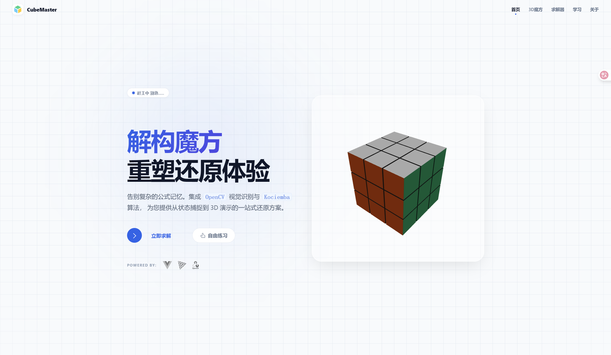
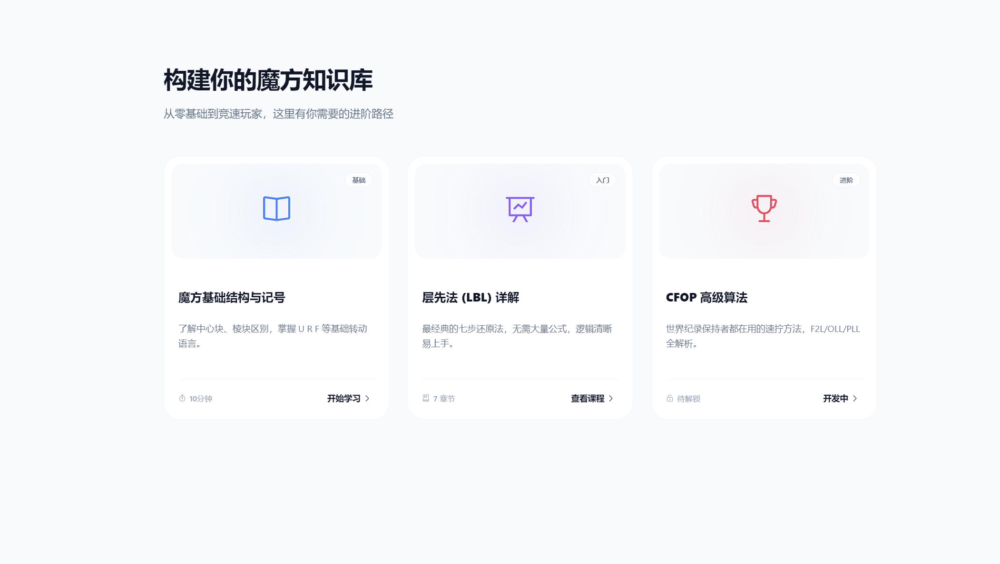
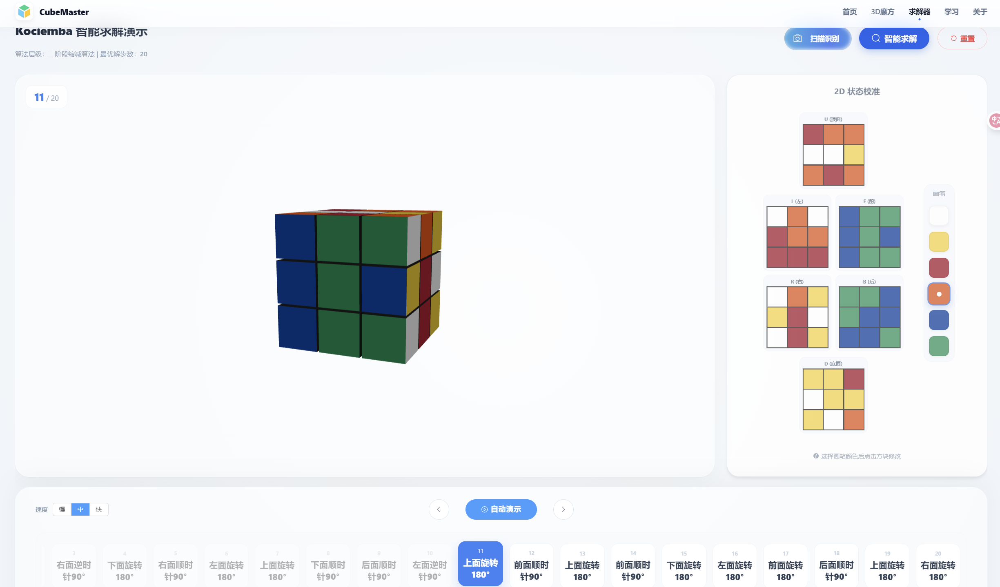

# CubeMaster - 智能魔方还原与教学系统

   

## 📖 项目简介 (Introduction)

**CubeMaster** 是一个集**计算机视觉识别**、**智能求解算法**与**3D 交互教学**于一体的现代化魔方应用。

本项目致力于降低魔方学习门槛，利用 **YOLOv8** 实时捕捉魔方状态，通过 **kociemba 二阶段算法** 计算毫秒级最优解，并结合 **Three.js** Web3D技术，提供直观的3D 还原教学。

### ✨ 核心亮点

* **AI 视觉识别**：集成 YOLOv8 深度学习模型，支持复杂光照下的色块识别，内置智能网格映射算法，有效消除拍摄角度偏差异常。
* **毫秒级求解**：后端搭载 kociemba 算法，可在 20 步内解决任意打乱状态，响应时间 < 100ms。
* **3D 直观演示**：基于 Three.js 开发的高保真 3D 魔方组件，支持鼠标交互旋转、公式动画演示、视角自由缩放。
* **交互式教程**：完整全面的的魔方还原教学公式，配合实时 3D 动画，让步骤清晰易懂。

---

## 📸 效果演示 (Demo)

### 1. 首页展示

> 
>
> 
>
> 

### 2. 自由练习模式展示

> 

### 3. 求解器展示

> 
>
> 
>
> 

### 4. 教学模块展示

> 
>
> 
>
> 

---

## 🛠️ 技术架构 (Architecture)

### 系统整体框架图

> 

### 求解器数据流图

> 

### 技术栈详细列表

|     模块     |        技术选型         |             说明              |
|:----------:|:-------------------:|:---------------------------:|
|  **前端框架**  |    Vue 3 + Vite     |        核心应用逻辑与组件化开发         |
| **UI 组件库** |    Element Plus     |          现代化界面交互组件          |
| **3D 引擎**  |      Three.js       | 负责魔方建模、材质渲染与交互 (Cube3DView) |
|  **后端服务**  |  FastAPI (Python)   |          高性能异步接口服务          |
| **视觉 AI**  |   YOLOv8 + OpenCV   |       目标检测、图像预处理与网格映射       |
|  **核心算法**  | Kociemba (Twophase) |      还原步骤计算 (20步内最优解)       |

---

## 📂 目录结构说明 (Directory Structure)

```text
CubeMaster/                       # 项目根目录
├── backend/                      # 后端服务根目录
│   ├── app.py                    # FastAPI 入口文件，定义 API 路由
│   ├── cube_image_detection.py   # YOLOv8 识别核心逻辑
│   ├── convert_cube_state.py     # 状态转换与 Kociemba 桥接
│   ├── cube_service.py           # 业务逻辑层
│   ├── image_utils.py            # Base64 图片处理工具
│   ├── verify_3d_data.py         # 求解结果数据验证模块
│   ├── requirements.txt          # Python 依赖清单
│   ├── models/                   # 存放训练好的 .pt 模型文件
│   └── cube_results/             # 识别结果和求解结果存储
│
├── frontend/                     # 前端应用根目录
│   ├── index.html                # 入口 HTML
│   ├── vite.config.js            # Vite 构建配置
│   ├── src/
│   │   ├── components/           # 可复用组件
│   │   ├── views/                # 页面视图
│   │   ├── layout/               # 布局组件
│   │   ├── utils/                # 魔方逻辑核心
│   │   ├── api/                  # API 接口封装
│   │   └── data/                 # 教程静态数据
│
├── yolo_train/                   # 模型训练相关脚本与数据集
├── merge_code.py                 # 项目代码合并工具
└── project_context.md            # 项目代码文档
```

---

## ⚡ 快速开始 (Quick Start)

### 1. 环境要求

* **Node.js** >= 16.0
* **Python** >= 3.8
* **推荐浏览器**: Chrome/Edge (获得最佳 WebGL 渲染性能)

### 2. 启动后端服务

```bash
# 进入后端目录
cd backend

# 安装核心依赖
python -m pip install -r requirements.txt

# 特别说明：二阶段算法库 (Kociemba) 手动安装
若 pip 无法直接下载, 请克隆以下仓库并放入 backend 目录或按其说明安装:
(https://github.com/hkociemba/RubiksCube-TwophaseSolver)

# 启动 FastAPI 服务 (推荐使用 python -m 方式以避免路径冲突)
python -m uvicorn app:app --reload
```

###  3. 启动前端界面

```bash
# 进入前端目录
cd frontend

# 安装 NPM 依赖包
npm install

# 启动 Vite 开发服务器
npm run dev
```

###  4. 使用说明
* 求解器模式：使用摄像头分步扫描魔方的六个面，系统将通过 YOLOv8 自动识别色块并给出还原步骤。

* 自由探索模式：支持手动拖拽 3D 实体模型，或使用键盘快捷键进行自由旋转练习。

* 学习模式：内置多种教学课程，提供分步 3D 动画演示，辅助初学者快速上手。

---

## 📜 WCA 标准参考 (Standard Reference)

### 1. 标准配色表

| 颜色        | 对面颜色       |
|:----------|------------|
| 白色（White） | 黄色（Yellow） |
| 红色（Red）   | 橙色（Orange） |
| 蓝色（Blue）  | 绿色（Green）  |

### 2. 二维视角


### 3. 面位缩写
- **U (Up)**：顶面（白色中心）  
- **R (Right)**：右面（红色中心）  
- **F (Front)**：前面（绿色中心）  
- **D (Down)**：底面（黄色中心）  
- **L (Left)**：左面（橙色中心）  
- **B (Back)**：后面（蓝色中心）

### 4.标准读取顺序

魔方状态数据按以下面位顺序读取/存储： 
`U（顶面）→ R（右面）→ F（前面）→ D（底面）→ L（左面）→ B（后面）` 

---

## 📄 许可证 (License)
本项目采用 MIT 许可证，详情请参阅 [LICENSE](LICENSE) 文件。
