# CubeMaster - 智能魔方还原与教学系统

   

## 📖 项目简介

**CubeMaster** 是一个集**计算机视觉识别**、**智能求解算法**与**3D 交互教学**于一体的现代化魔方应用。

本项目致力于降低魔方学习门槛，利用 **YOLOv8** 实时捕捉魔方状态，通过 **Kociemba 二阶段算法** 计算毫秒级最优解，并结合 **Three.js** Web3D技术，提供直观的3D还原教学。

### ✨ 核心亮点

* **AI 视觉识别**：集成 YOLOv8 深度学习模型，支持复杂光照下的色块识别，内置智能网格映射算法，有效消除拍摄角度偏差异常。
* **毫秒级求解**：后端搭载 Kociemba 算法，可在 20 步内解决任意打乱状态，响应时间 < 100ms。
* **3D 直观演示**：基于 Three.js 开发的高保真 3D 魔方组件，支持鼠标交互旋转、公式动画演示、视角自由缩放。
* **交互式教程**：完整全面的魔方还原教学公式，配合实时 3D 动画，让步骤清晰易懂。
* **深色模式**：完整的深色主题适配，支持跟随系统偏好自动切换。
* **外观定制**：自定义魔方材质、纹理、光照、几何体参数，打造独一无二的个性化魔方。
* **CFOP算法库**：内置多种标准公式，支持难度分级、搜索过滤和3D演示。

---

## 📸 效果演示

### 1. 首页展示

> 
>
> 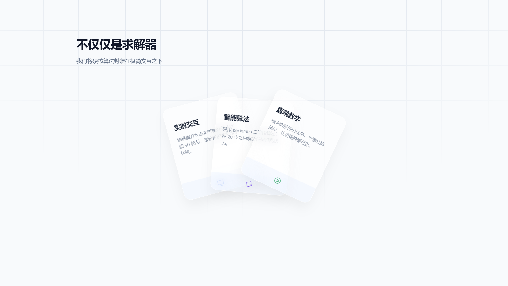
>
> 

### 2. 深色模式

> 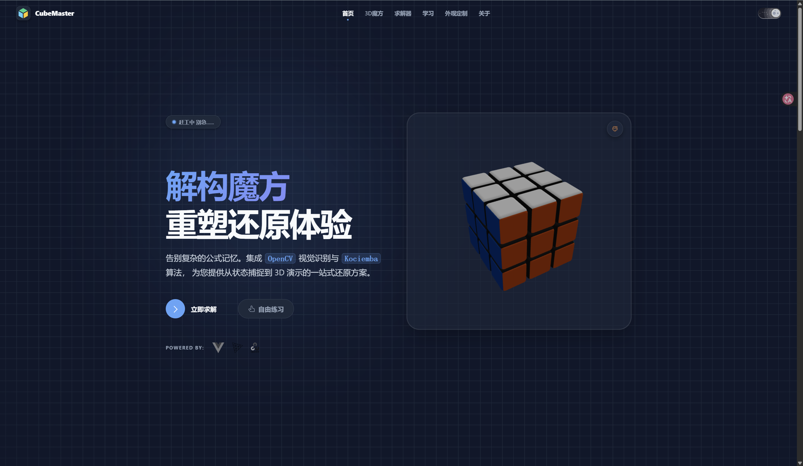

### 3. 魔方外观定制

> 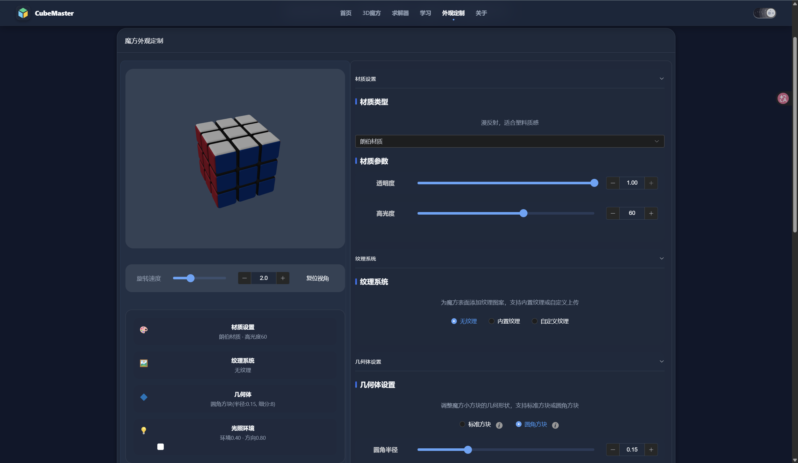

### 4. 自由练习模式

> 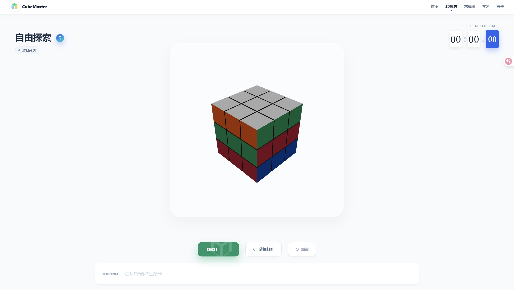

### 5. 求解器

> 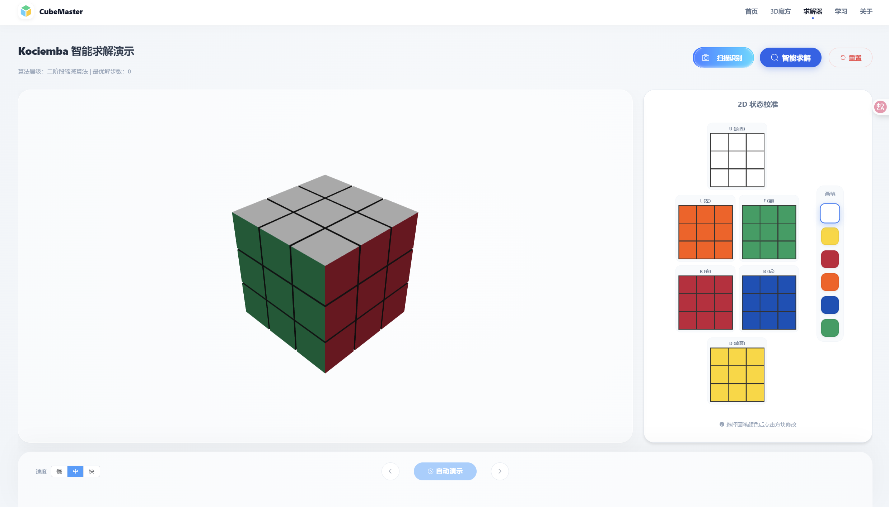
>
> 
>
> 

### 6. 教学模块

> 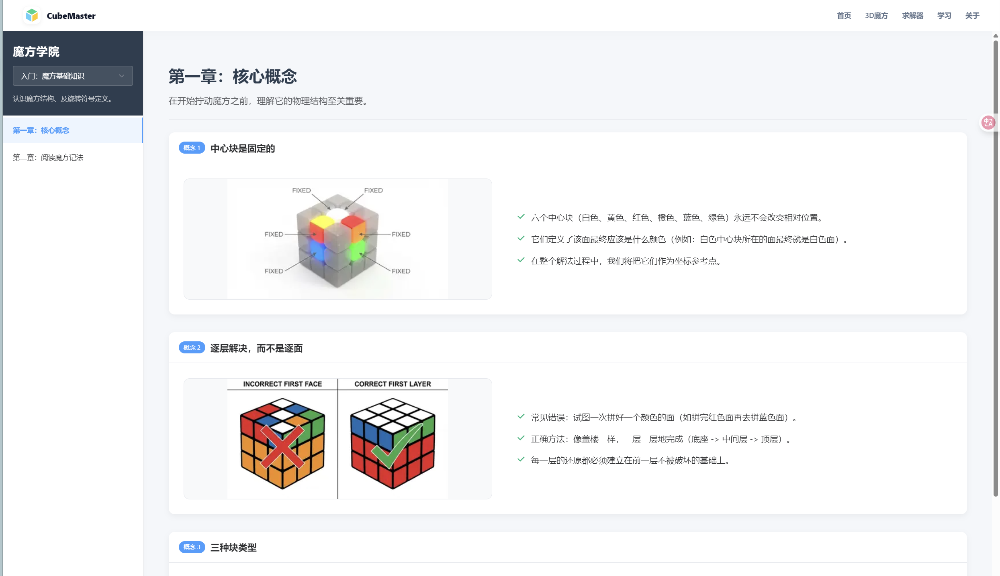
>
> 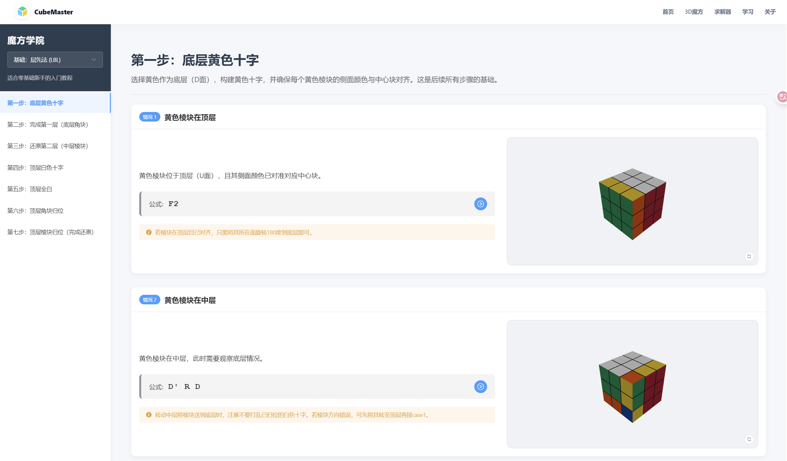
>
> 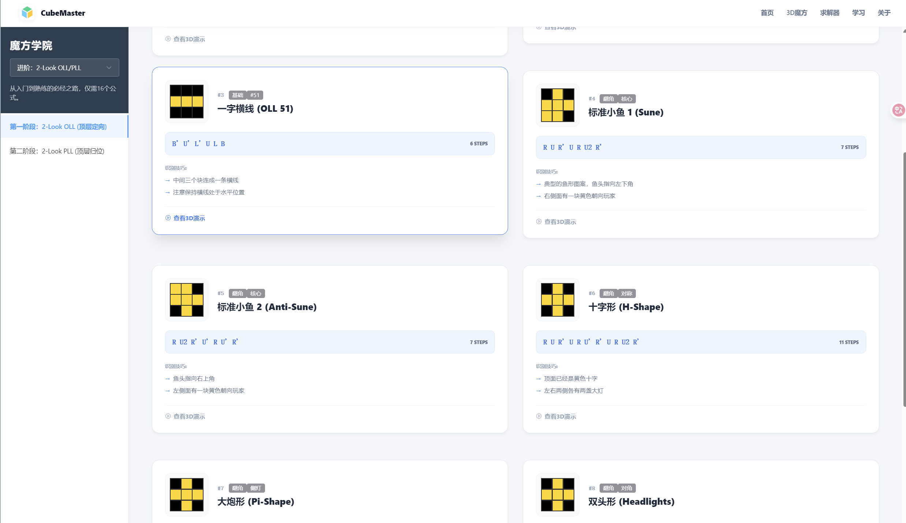

### 7. CFOP 算法库

> 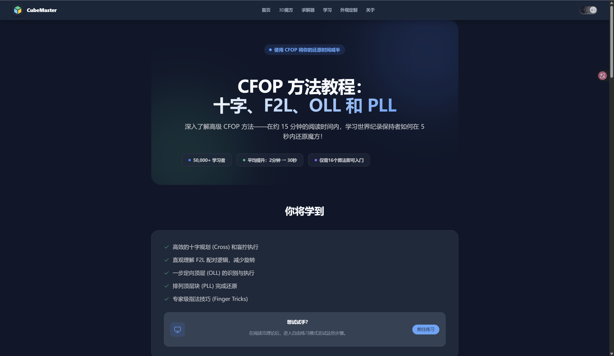
>
> 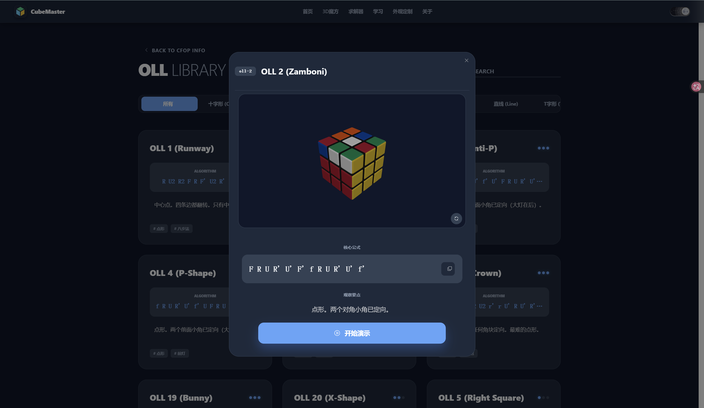

### 8. 关于页面

> 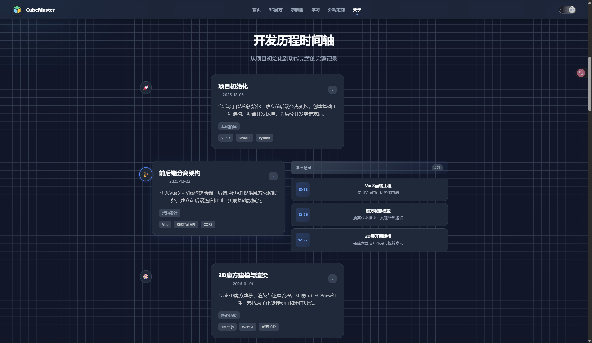

---

## 🛠️ 技术架构

### 系统整体框架图

> 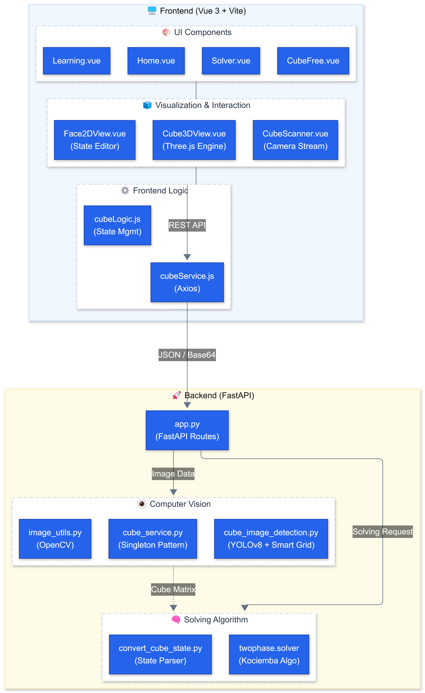

### 求解器数据流图

> 

### 技术栈

| 模块     | 技术选型                | 说明                  |
|:-------|:--------------------|:--------------------|
| 前端框架   | Vue 3 + Vite        | 核心应用逻辑与组件化开发        |
| UI 组件库 | Element Plus        | 现代化界面交互组件           |
| 3D 引擎  | Three.js            | 魔方建模、材质渲染与交互        |
| 后端服务   | FastAPI (Python)    | 高性能异步接口服务           |
| 视觉 AI  | YOLOv8 + OpenCV     | 目标检测、图像预处理与网格映射     |
| 核心算法   | Kociemba (Twophase) | 还原步骤计算 (20步内最优解)    |
| 状态管理   | Vue Composables     | 组合式API管理主题、自定义配置等状态 |

---

## 📂 目录结构

```text
CubeMaster/
├── backend/                      # 后端服务
│   ├── app.py                    # FastAPI 入口文件
│   ├── cube_image_detection.py   # YOLOv8 识别核心逻辑
│   ├── convert_cube_state.py     # 状态转换与 Kociemba 桥接
│   ├── cube_service.py           # 业务逻辑层
│   ├── image_utils.py            # Base64 图片处理工具
│   ├── verify_3d_data.py         # 求解结果数据验证模块
│   ├── requirements.txt          # Python 依赖清单
│   ├── models/                   # YOLO 模型文件
│   ├── cube_results/             # 识别和求解结果存储
│   └── tests/                    # 测试文件
│
├── frontend/                     # 前端应用
│   ├── index.html                # 入口 HTML
│   ├── vite.config.js            # Vite 构建配置
│   ├── src/
│   │   ├── components/           # 可复用组件
│   │   │   ├── Cube3DView.vue    # 3D魔方渲染核心组件
│   │   │   ├── Face2DView.vue    # 2D魔方展开图组件
│   │   │   ├── LoadingCube.vue   # 3D魔方旋转加载动画
│   │   │   └── ThemeSwitch.vue   # 主题切换组件
│   │   ├── views/                # 页面视图
│   │   │   ├── Home.vue          # 首页
│   │   │   ├── Solver.vue        # 求解器
│   │   │   ├── CubeFree.vue      # 自由练习
│   │   │   ├── Learning.vue      # 教学
│   │   │   ├── CfopIntro.vue     # CFOP介绍
│   │   │   ├── CfopAlgorithmLibrary.vue  # CFOP算法库
│   │   │   ├── Customizer.vue    # 外观定制
│   │   │   ├── About.vue         # 关于页面
│   │   │   └── Tech*.vue         # 技术文档页面
│   │   ├── layout/               # 布局组件
│   │   ├── composables/          # 组合式函数
│   │   │   ├── useTheme.js       # 主题管理
│   │   │   └── useCubeCustomization.js  # 外观自定义
│   │   ├── utils/                # 工具函数
│   │   ├── api/                  # API 接口封装
│   │   └── data/                 # 教程静态数据
│
├── scripts/                      # 工具脚本
└── yolo_train/                   # 模型训练相关
```

---

## ⚡ 快速开始

### 环境要求

* **Node.js** >= 16.0
* **Python** >= 3.8
* **推荐浏览器**: Chrome/Edge (获得最佳 WebGL 渲染性能)

### 启动后端服务

```bash
cd backend
python -m pip install -r requirements.txt

# Kociemba 算法库安装
# 若 pip 无法直接下载，请克隆以下仓库并放入 backend 目录：
# https://github.com/hkociemba/RubiksCube-TwophaseSolver

python -m uvicorn app:app --reload
```

### 启动前端界面

```bash
cd frontend
npm install
npm run dev
```

---

## 📖 功能模块

| 模块      | 功能描述                        |
|:--------|:----------------------------|
| 求解器     | 摄像头扫描六面，YOLOv8自动识别色块，输出还原步骤 |
| 自由练习    | 拖拽3D模型或键盘快捷键自由旋转            |
| 学习模式    | 分步3D动画教学，初学者快速入门            |
| CFOP算法库 | OLL/PLL公式浏览，支持搜索、难度分级、3D演示  |
| 外观定制    | 材质/纹理/光照/几何体参数自定义           |

---

## 📜 WCA 标准参考

### 1. 标准配色表

| 颜色        | 对面颜色       |
|:----------|------------|
| 白色（White） | 黄色（Yellow） |
| 红色（Red）   | 橙色（Orange） |
| 蓝色（Blue）  | 绿色（Green）  |

### 2. 二维视角

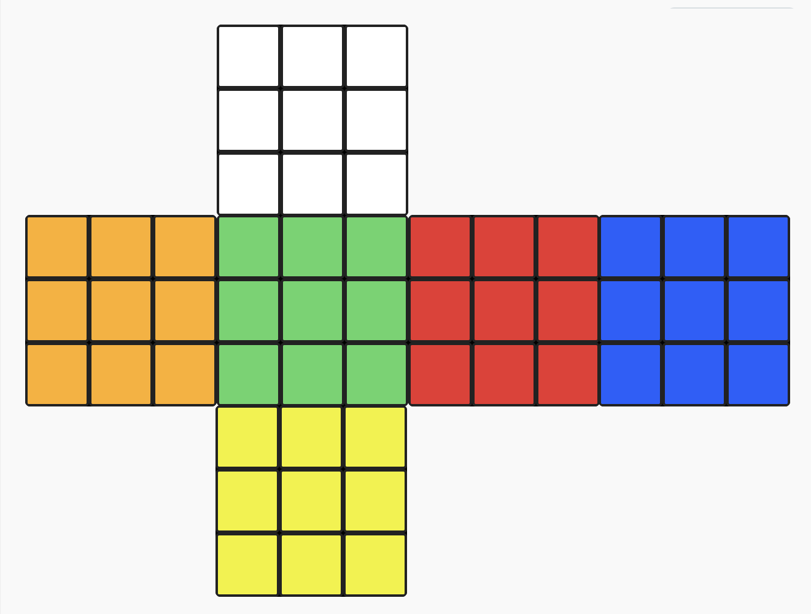

### 3. 面位缩写
- **U (Up)**：顶面（白色中心）  
- **R (Right)**：右面（红色中心）  
- **F (Front)**：前面（绿色中心）  
- **D (Down)**：底面（黄色中心）  
- **L (Left)**：左面（橙色中心）  
- **B (Back)**：后面（蓝色中心）

### 4.标准读取顺序

魔方状态数据按以下面位顺序读取/存储： 
`U（顶面）→ R（右面）→ F（前面）→ D（底面）→ L（左面）→ B（后面）` 

---

## 📄 许可证

本项目采用 MIT 许可证，详情请参阅 [LICENSE](LICENSE) 文件。

---

## 🙏 致谢

- [YOLOv8](https://github.com/ultralytics/ultralytics) - 目标检测框架
- [Kociemba Solver](https://github.com/hkociemba/RubiksCube-TwophaseSolver) - 二阶段求解算法
- [Three.js](https://threejs.org/) - 3D 渲染引擎
- [Element Plus](https://element-plus.org/) - Vue 3 UI 组件库

---

*最后更新: 2026-02-23*
