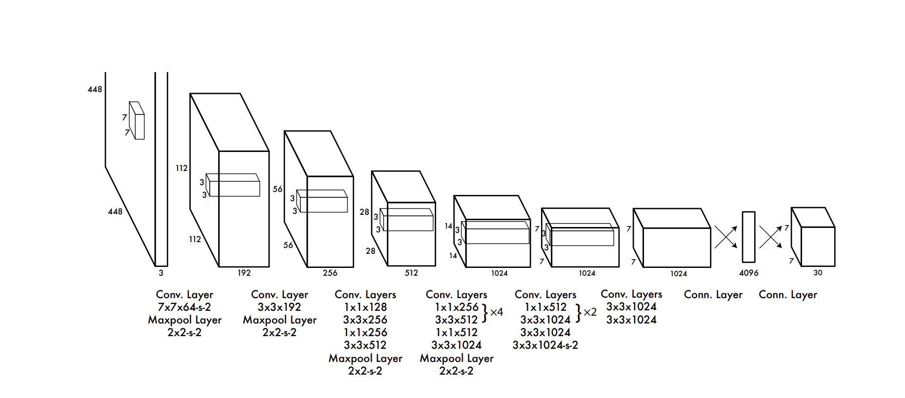

# YOLOv1 论文精读与学习总结

## 1. 基本信息

- **论文标题**：You Only Look Once: Unified, Real-Time Object Detection
- **核心作者**：Joseph Redmon, Ross Girshick 等
- **发表时间**：CVPR 2016
- **一句话总结**："你只需要看一次" 将目标检测从传统的分类问题转换为**端到端回归问题**，直接从完整图像一次性预测边界框位置和类别概率

---

## 2. 研究背景与核心痛点

**现有方法的瓶颈（两阶段，如 R-CNN 系列 / DPM）**

- 需要先提取候选区域（Region Proposals），再进行分类，最后进行非极大值抑制（NMS）和边界框微调
- **缺点**：流程复杂（多阶段），各组件需单独训练，导致**检测速度慢**，难以满足实时应用需求

**YOLOv1 的解决思路**

- 去除繁琐的候选框提取步骤，直接将整张图输入单个卷积神经网络（CNN）
- 实现**统一的、实时的**目标检测框架

---

## 3. YOLO 模型核心思想

### 3.1 网格划分

系统将输入图像（448 x 448）划分为 $S \times S$（默认 $S=7$）的网格。

**核心原则**：如果一个物体的**中心点**落入某个 Grid Cell 内，那么**该 Grid Cell 就负责检测该物体**。

### 3.2 预测张量

每个 Grid Cell 需要预测 $B$ 个边界框（默认 $B=2$）及其置信度，外加 $C$ 个类别的条件概率（VOC 数据集中 $C=20$）。

**每个 Bounding Box 包含 5 个预测值**：$x, y, w, h$, confidence

- $(x, y)$：相对于当前 Grid Cell 边界的中心点坐标偏移量（范围 0~1）
- $(w, h)$：相对于整张图像的宽度和高度的比例（范围 0~1）
- confidence：计算公式为 $\text{Pr(Object)} \times \text{IOU}_{\text{pred}}^{\text{truth}}$

**输出张量维度**

$$
S \times S \times (B \times 5 + C)
$$

> **注**：在 PASCAL VOC 数据集上，$S=7, B=2, C=20$，最终网络输出特征图尺寸为 **$7 \times 7 \times 30$**。

### 3.3 测试阶段的分类得分

将类的条件概率与边界框的置信度相乘，得到每个框的类别置信度得分：

$$
\text{Pr(Class}_i | \text{Object)} \times \text{Pr(Object)} \times \text{IOU}_{\text{pred}}^{\text{truth}} = \text{Pr(Class}_i) \times \text{IOU}_{\text{pred}}^{\text{truth}}
$$

---

## 4. 网络结构

- **灵感来源**：基于 GoogLeNet 图像分类模型修改
- **组成部分**：24 层卷积层（提取图像特征）+ 2 层全连接层（线性回归预测）
- **激活函数**：最后一层使用线性激活，其余层使用 Leaky ReLU（$\alpha = 0.1$）
- **Fast YOLO**：仅使用 9 层卷积层，速度可达 155 FPS

---

## 5. 损失函数（核心重点）

YOLOv1 将检测视为回归问题，全部采用**均方差误差（Sum-squared error）**。引入权重惩罚参数：$\lambda_{\text{coord}} = 5$，$\lambda_{\text{noobj}} = 0.5$。

损失函数由 **5 部分**组成：

$$
\begin{aligned}
\text{Loss} = 
& \lambda_{\text{coord}} \sum_{i=0}^{S^2} \sum_{j=0}^{B} \mathbb{1}_{ij}^{\text{obj}} \left[ (x_i - \hat{x}_i)^2 + (y_i - \hat{y}_i)^2 \right] \quad \text{(1. 中心点坐标定位误差)} \\
& + \lambda_{\text{coord}} \sum_{i=0}^{S^2} \sum_{j=0}^{B} \mathbb{1}_{ij}^{\text{obj}} \left[ (\sqrt{w_i} - \sqrt{\hat{w}_i})^2 + (\sqrt{h_i} - \sqrt{\hat{h}_i})^2 \right] \quad \text{(2. 边界框宽高定位误差)} \\
& + \sum_{i=0}^{S^2} \sum_{j=0}^{B} \mathbb{1}_{ij}^{\text{obj}} (C_i - \hat{C}_i)^2 \quad \text{(3. 含物体框的 Confidence 误差)} \\
& + \lambda_{\text{noobj}} \sum_{i=0}^{S^2} \sum_{j=0}^{B} \mathbb{1}_{ij}^{\text{noobj}} (C_i - \hat{C}_i)^2 \quad \text{(4. 不含物体框的 Confidence 误差)} \\
& + \sum_{i=0}^{S^2} \mathbb{1}_{i}^{\text{obj}} \sum_{c \in \text{classes}} (p_i(c) - \hat{p}_i(c))^2 \quad \text{(5. 含物体 Grid Cell 的类别预测误差)}
\end{aligned}
$$

**关键细节解析**

1. **为什么对宽高 $(w, h)$ 开根号？**
   
   同样的绝对误差，对小框的影响远大于大框。开根号可有效拉近大框和小框的惩罚差异。

2. **参数 $\lambda_{\text{noobj}} = 0.5$ 的作用**
   
   图像中大部分网格无物体（背景）。不加抑制会导致大量负样本产生压倒性梯度，使模型不稳定。因此需削弱不含物体框的置信度误差权重。

3. **指示函数 $\mathbb{1}_{ij}^{\text{obj}}$ 的含义**
   
   表示第 $i$ 个网格中的第 $j$ 个 bbox 预测器是否对该真实物体"负责"（即该预测框与 Ground Truth 的 IOU 最大）。

---

## 6. 模型优缺点分析

### 优势

1. **速度极快**：基础版 45 FPS，Fast 版本 155 FPS，适合实时视频流检测
2. **全局感受野**：观测完整图像，包含丰富上下文信息，背景误检率不到 Fast R-CNN 的一半
3. **泛化能力强**：学到物体通用特征，从自然图像迁移到艺术品等领域时，表现远超 DPM 和 R-CNN

### 局限性

1. **群体小目标检测差**：每个 Grid Cell 只能预测 2 个框且只能属于 1 个类别，难以预测密集小物体（如鸟群、人群）
2. **对不寻常比例物体泛化差**：测试集中出现训练集未见的异常长宽比物体时，定位效果差
3. **定位误差大**：这是 YOLOv1 的主要错误来源，虽然 Loss 中加入开根号处理，但仍无法完美解决大框与小框误差权重分配问题

---

## 7. 学习心得与扩展思考

- YOLOv1 开创了 **One-Stage（单阶段）**目标检测的先河，摒弃生成 Region Proposal 的繁琐步骤，直接利用全图信息回归，是思想上的巨大飞跃
- 尽管 YOLOv1 在小目标检测和定位精度上不如 Faster R-CNN，但它明确了"速度+全图推理"的优势路线
- **后续演进**：YOLOv1 中的缺点（缺乏多尺度特征、Grid Cell 的强绑定限制），在 YOLOv2（引入 Anchor Boxes）、YOLOv3（多尺度 FPN 结构）中得到解决
